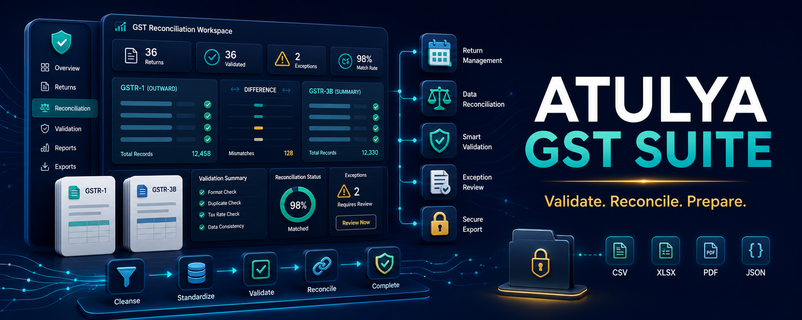

# Atulya GST

> **Prepare, check and reconcile GST working data with confidence.** 🧾🇮🇳

Atulya GST is a planned free workspace for GST data preparation, reconciliation and permitted upload/download workflows. It aims to remove spreadsheet confusion while keeping final submission controlled by the taxpayer or authorized professional.

> 🚧 This is a product plan, not a filing product today. No automatic filing or API access is currently provided.

## ✅ Planned Workflows

| Tool | Outcome |
|---|---|
| Invoice validator | Identify missing GSTIN, HSN/SAC, tax breakup and duplicate invoice issues |
| GSTR-1 workspace | Prepare outward supply data and validation report |
| GSTR-2B reconciliation | Compare purchase register with downloaded data |
| ITC mismatch review | Produce action-ready supplier/mismatch sheets |
| E-invoice preparation | Validate and create payload working files for authorized submission |
| E-way bill preparation | Prepare transport and item data in supported formats |
| Challan tracker | Organize payment references, status and evidence documents |
| Filing calendar | Deadlines, reminders and completion evidence |

## 🖱️ One-Click Flow

Planned installers: Windows `.exe`, macOS `.dmg`, Linux AppImage and Docker-based team workspace.

## 🧱 Architecture

- Local validation engine with versioned rule packs.
- Reconciliation engine for invoice matching and exception categories.
- Document vault for return evidence and generated reports.
- Authorized connector layer only after official integration requirements are satisfied.
- Full audit log for imports, transformations and exports.

## 🗺️ Roadmap

| Phase | Delivery |
|---|---|
| 1 | Invoice import, schema validation and exception Excel report |
| 2 | GSTR-2B reconciliation and ITC mismatch workspace |
| 3 | GSTR-1 preparation and filing calendar |
| 4 | E-invoice/e-way bill preparation files and QR verification support |
| 5 | Authorized API connectors where access and compliance permit |

## ⚠️ Compliance Boundary

Atulya GST will not bypass GST portal authentication, OTP, CAPTCHA or authorization requirements. It will support official formats and authorized integration paths only. Users remain responsible for review and filing.

## 🔗 Independent Atulya Projects

This is a standalone product. Discover other independent Atulya repositories: [Automation Hub](https://github.com/atulyaai/Atulya-Automation-Hub) · [ERP](https://github.com/atulyaai/Atulya-Accounting-ERP) · [SAP](https://github.com/atulyaai/Atulya-SAP-Automations) · [Office](https://github.com/atulyaai/Atulya-Office) · [HR](https://github.com/atulyaai/Atulya-HR-Suite) · [DataClean](https://github.com/atulyaai/Atulya-Data-Scruber) · [Invoice](https://github.com/atulyaai/Atulya-Invoice) · [Convert](https://github.com/atulyaai/Atulya-All-File-Converter) · [Host](https://github.com/atulyaai/Atulya-Launch)

## 📜 License

MIT planned for the open-source core; official schemas and regulatory materials retain their applicable terms.
